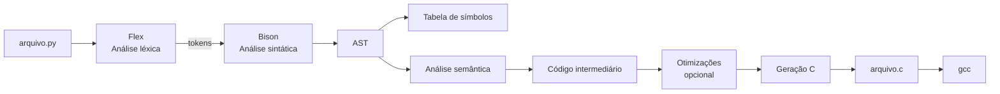

# Guia Detalhado

Roteiro de implementação do compilador **Python → C**, adaptado do [Guia – Projeto de um Compilador](https://github.com/sergioaafreitas/COMP1) da disciplina e da proposta de trabalho (PBL + Scrum).

Equipe: **4 pessoas** · Ferramentas: **Flex + Bison** · Alvo: **C (GCC)**

---

## Visão da arquitetura

---

## Passos de construção

### 1. Definir a linguagem-fonte (subset Python)

- Descrever sintaxe e semântica da subset (ver [Especificação](Especificacao_do_projeto.md)).
- Elaborar gramática livre de contexto (GLC) das construções escolhidas.
- Fixar exemplos canônicos de entrada (`.py`) e saída esperada (`.c`).

### 2. Análise léxica com Flex

- Criar `lexer.l` com ERs para:
  - identificadores e palavras-chave (`if`, `else`, `while`, `def`, `return`, `print`, `True`, `False`, …);
  - literais numéricos e strings;
  - operadores e delimitadores;
  - espaços/comentários ignorados (`# ...`).
- Validar tokens isoladamente antes de depender do parser.

### 3. Analisador sintático com Bison

- Criar `parser.y` com a gramática da subset.
- Associar tokens às produções.
- Tratar erros sintáticos (`yyerror`, recuperação simples).
- Nas ações, construir a **AST** (não só “aceitar/rejeitar”).

### 4. Análise semântica básica

- Popular e consultar a **tabela de símbolos** (escopo global; depois funções).
- Verificar: variável usada sem atribuição/definição; tipos em operações simples; aridade básica.
- Reportar erros semânticos com mensagens claras.

### 5. Código intermediário

- Definir IR simples (ex.: três endereços ou lista de instruções).
- Percorrer a AST e emitir IR.
- Manter a IR independente o bastante para facilitar o backend C.

### 6. Otimização (recomendado)

- Constant folding
- Remoção de código morto trivial
- Outras otimizações locais, se houver tempo

### 7. Geração do código final (C)

- Traduzir IR (ou AST) para C:
  - atribuições → declarações e atribuições C;
  - `print` → `printf`;
  - `def` → funções C;
  - controle de fluxo → `if` / `while`.
- Testar compilando com `gcc saida.c -o saida`.

---

## Sugestão de sprints (guia da disciplina → nosso projeto)

O guia oficial propõe 6 sprints. Abaixo, o mapeamento para **Python → C** e para os marcos **P1 / P2 / T** (detalhamento de datas em [Planejamento das Sprints](../planejamento/planejamento_das_sprints.md)).

### Sprint 1 — Fundação

| | |
| --- | --- |
| **Objetivos** | Formar equipe, ambiente Flex/Bison, definir subconjunto Python → C, rascunho da GLC |
| **Entregas** | Doc da linguagem; esboço `.l`/`.y`; hello Flex/Bison rodando |
| **Tarefas** | Escopo; repo GitHub; tools; gramática inicial |

Adicionar o professor ao repositório quando solicitado na entrega final (acesso ~15 dias antes da entrevista).

### Sprint 2 — Léxico + início do parser + P1

| | |
| --- | --- |
| **Objetivos** | Lexer completo; parser inicial; material P1 |
| **Entregas** | `.l` funcional; primeiras regras `.y`; formulário P1; demo ≤ 5 min |
| **Tarefas** | ERs finais; parser básico; testes; slides/demo; formulário |

### Sprint 3 — Parser completo, AST e semântica inicial

| | |
| --- | --- |
| **Objetivos** | Ampliar gramática; AST; tabela de símbolos; primeiros erros semânticos |
| **Entregas** | Parser da subset; AST/dump; símbolos; checagens básicas |
| **Tarefas** | Extensão Bison; popular tabela; montar AST; testes de unidade |

### Sprint 4 — Semântica + IR + P2

| | |
| --- | --- |
| **Objetivos** | Semântica robusta; IR; preparar P2 |
| **Entregas** | Semântica estável; gerador de IR; formulário P2; demo de evolução |
| **Tarefas** | Refinar tipos/escopos; emitir IR; testes; apresentação P2 |

### Sprint 5 — Otimização + geração C + integração

| | |
| --- | --- |
| **Objetivos** | Otimizações simples; codegen C; testes ponta a ponta |
| **Entregas** | `.py` → `.c` compilado pelo GCC; suíte de exemplos |
| **Tarefas** | Folding/DCE; emissor C; integração; correção de bugs |

### Sprint 6 — Entrevista final (T)

| | |
| --- | --- |
| **Objetivos** | Entrevistas; ajustes finais; documentação completa |
| **Entregas** | Compilador final no GitHub; README/manual; domínio coletivo do código |
| **Tarefas** | Ensaio; bugfix; docs; presença obrigatória de todos |

---

## Ritual Scrum nas quartas

1. **Daily rápida** (5–10 min): o que fiz / o que farei / bloqueio.
2. **Hands-on** no compilador (integração e PRs).
3. **Review** ao fim da sprint: demo interna do incremento.
4. Atualizar: atas, problemas/soluções, decisões e atividades semanais.

---

## Checklist de documentação (obrigatória)

- [x] Estrutura do projeto
- [x] Decisões técnicas (página dedicada)
- [x] Planejamento das sprints
- [x] Problemas encontrados e soluções
- [ ] Atualização contínua a cada sprint (manter vivo)

---

## Dicas finais (guia + proposta)

1. Usar as **quartas** para integração e transparência de tarefas.
2. Review de sprint com demo curta.
3. Testes por fase (léxico, sintático, semântico, C).
4. Respeitar **datas dos formulários** P1/P2 — erro no envio zera a nota.
5. Preparar-se para possível saída de integrante: não concentrar conhecimento.
6. Deixar folga no cronograma para bugs e feriados.
7. Commits frequentes; formulário só pelo **líder**.

Este guia é o mapa de implementação; o calendário fechado com datas de 2026/2 está no [Cronograma](../planejamento/cronograma.md).
