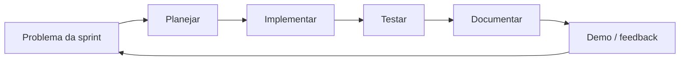

# Metodologia

A disciplina adota **aulas expositivas + Problem Based Learning (PBL)**. A equipe aplica o mesmo ciclo ao compilador **Python → JavaScript**.

## Dinâmica da disciplina

| Dia | Tipo | Uso pela equipe |
| --- | --- | --- |
| Segunda (16h–17h50) | Aula teórica | Alinhar conceitos (autômatos, GLC, semântica, geração) ao design do compilador |
| Quarta (16h–17h50) | Prática / PBL | Implementar, integrar e testar incrementos no repositório |

Material de apoio do professor: [slides CEDIS](https://slides.cedis.tec.br/c/sergio-compiladores) · repositório de referência: [sergioaafreitas/COMP1](https://github.com/sergioaafreitas/COMP1).

## Ciclo PBL da equipe

1. **Problema:** o que falta no pipeline Python → JS nesta sprint.
2. **Planejar:** quebrar em tarefas para 4 pessoas (ver papéis).
3. **Implementar:** Flex/Bison/C, commits pequenos e revisáveis.
4. **Testar:** casos `.py` de entrada e saída `.js` esperada.
5. **Documentar:** atualizar atas, decisões, problemas/soluções e o site MkDocs.
6. **Demo:** mostrar avanço em aula ou na reunião semanal do grupo.

## Organização do grupo (4 pessoas)

Papéis **fixos** (podem rotacionar a cada sprint, mas cada um mantém uma frente principal):

| Papel | Responsabilidade principal | Frente técnica |
| --- | --- | --- |
| **Líder / integração** | Prazos, formulários P1/P2, merge e demo | Integração do pipeline e releases |
| **Léxico** | Tokens e ERs da subset Python | `lexer` (Flex) |
| **Sintaxe / AST** | Gramática, erros, árvore | `parser` (Bison) + AST |
| **Semântica / backend** | Tabela de símbolos, checagens, emissão JS | Semântica + codegen |

Boas práticas:

- Ninguém concentra sozinho uma fase crítica perto de P1/P2/T.
- Pair programming nas quartas para transferência de conhecimento (a entrevista pode sortear qualquer membro).
- Decisões relevantes vão para [Decisões Técnicas](../decisoes/decisao.md).

## Ritmo semanal sugerido

| Quando | Atividade |
| --- | --- |
| Após a segunda | Atualizar backlog da sprint com o tema teórico |
| Quarta (aula) | Coding session coletivo |
| Até domingo | Fechar PR/issues da semana + atualizar docs |
| Antes de P1/P2 | Ensaio da apresentação (todos falam pelo menos um tópico) |

## Critérios internos de qualidade

- Código organizado e compilável a partir do README/docs.
- Subset Python documentada (o que entra / o que não entra).
- Exemplos de entrada (`.py`) e saída (`.js`) versionados.
- Site MkDocs refletindo o estado real do projeto.

## Taxonomia de Bloom (alinhamento)

| Nível | Como aparece no projeto |
| --- | --- |
| Aplicação | Usar Flex/Bison para implementar fases do compilador |
| Análise | Diagnosticar erros léxicos/sintáticos/semânticos e trade-offs de design |
| Criação | Projetar a subset e o gerador Python → JavaScript funcional |
